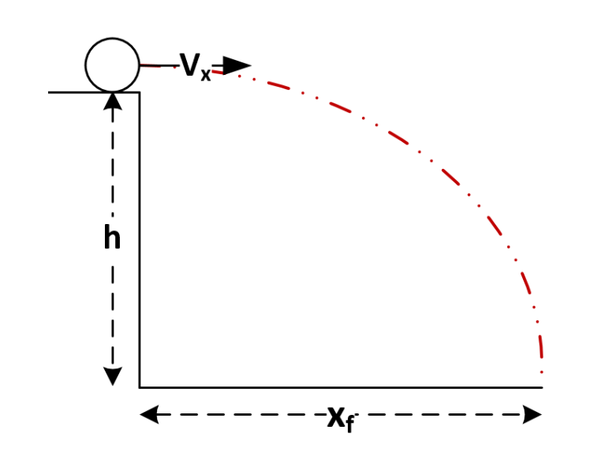

**Question 1**. Write a program that converts time given in seconds as an integer into “hh:mm:ss”format. All these three values, h for hour, m for minute, and s for second will be given as integers.

**NOTE**: If either the hour, minute, or the second value is smaller than 10, you must print a 0 next

to it (i.e. Instead of 9:3:45, the program should print out 09:03:45)

**Examples**:

Input 100   3700    8000

Output 00:01:40 01:01:40 02:13:20

**-----------------------------------------------------------------------------------------------------------------------------------------**

**Question 2.** Write a program that computes and displays the area of a geometrical shape. First, the program will read the type of the shape which is given in as a character. Then, based on the shape, you will read one or two more values.

The type of the shapes can either be,

• s or S for square

• r or R for rectangle

• c or C for circle.

If the shape is a square, then the program will read 1 input: the edge length (**a**)

If the shape is a rectangle, then the program will read 2 inputs: edge length (**a**) and height (**h**)

If the shape is a circle, then the program will read 1 input: radius (**r**)

After that, your program will compute the **AREA** of the given shape and print it out to the screen

as a double value.

**NOTE**: Area formulations of the shapes are as below:

Square Rectangle Circle

a\*a

a\*h

pi\*r\*r

**NOTE**: Take pi as 3.14

Input S 5r 4 8C 2

Output 25   32    12.56

**-----------------------------------------------------------------------------------------------------------------------------------------**

**Question 3.** An object is thrown near a cliff as depicted in the following figure

Write a program which calculates after s seconds whether the object hits the ground or not. Your program will read three double values, x velocity ( ), the height of the cliff ( ), and seconds passed (s). After the object is thrown, it will start moving to the right with a CONSTANT speed of V\_x. At the same time, it will start to drop down due to gravity. The vertical distance the object will cover by falling after t seconds is calculated by the formula given below.

Based on the input values, your program will check if the object hits the ground within s seconds or not. The output of the program varies as below:

•If the object hits the ground within s seconds:

Output: "Object hit the ground, time until crash: time
Final x distance:x"

•If the object DID NOT hit the ground within s seconds:
Output: "Object did not hit the ground.
Final x distance:x
Final height:h"

All the output values will be double values.

**HINT**: Formula:h=1/2gt^2 and take G as 9.81

**HINT**: In order to calculate the squareroot of a given number you can use the Math.sqrt method as shown below:

Y = Math.sqrt(X);

**Examples**:

**Input:** 12.5 33.6 1.7

**Output:**

Object did not hit the ground

Final x distance: 21.250001

Final height: 19.424548

**Input:** 12.45 25.76 3.5

**Output:** 

Object hit the ground

Time until crash: 2.291677

Final x distance: 28.531378

